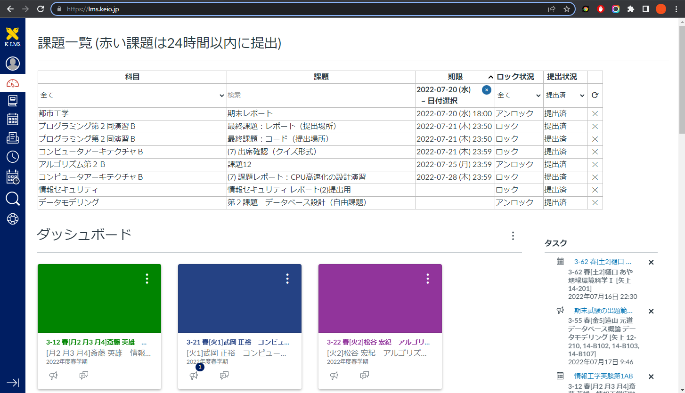

# Keio Tracker

This extension allows you to view all available assignments on K-LMS, a learning management system for Keio University.

You can filter assignments by course name, assignment name, deadline, lock status and submission status.

You can jump into assignment pages by clicking the rows in the table.

You can hide assignments by clicking ✕ button and reset by ⟳ button. This operation is retained after navigating pages.

